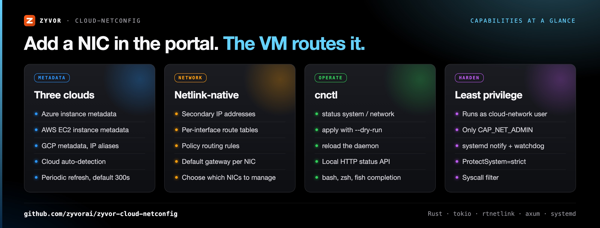
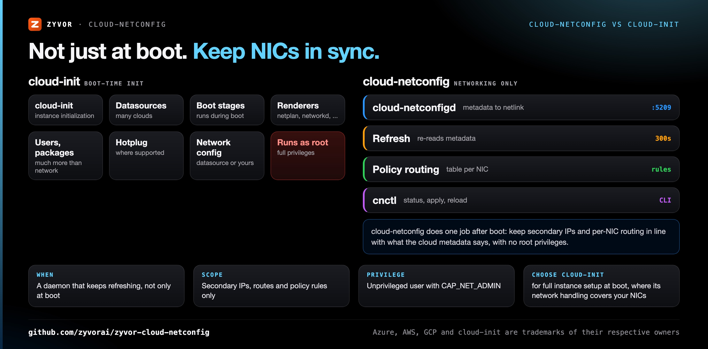
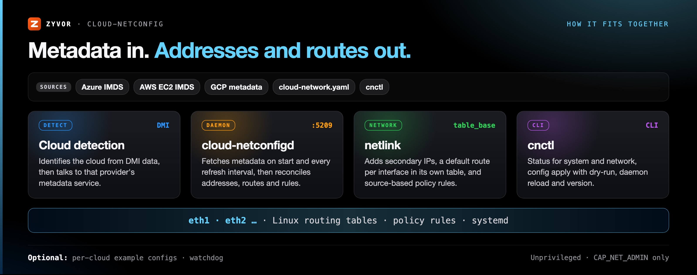

<div align="center">

# cloud-netconfig

[](https://github.com/zyvorai/zyvor-cloud-netconfig/actions/workflows/ci.yml)
[](https://www.apache.org/licenses/LICENSE-2.0)
[](https://github.com/zyvorai/zyvor-cloud-netconfig/releases)
[](Cargo.toml)

[](https://zyvor.dev/schedule?utm_source=github&utm_medium=cloud-netconfig&utm_campaign=readme_hero)
[](https://zyvor.dev/poc?utm_source=github&utm_medium=cloud-netconfig&utm_campaign=readme_hero)
[](#quickstart)


### Secondary IPs and routes. Configured from metadata.

**Automatic network configuration for cloud instances using provider metadata (Azure, AWS, GCP, and others).** Handles secondary IPs, routing tables, and policy-based routing on multi-interface VMs. Community Edition daemon from the Zyvor Platform suite — runs unprivileged with `CAP_NET_ADMIN`.

**Azure · AWS EC2 · GCP metadata** · **Policy routing per NIC** · **Netlink-native, Rust** · **Unprivileged, CAP_NET_ADMIN** · **deb · rpm · Arch packages**

📖 **[Enterprise & support](docs/enterprise.md)** · [Demo](https://zyvor.dev/demo?utm_source=github&utm_medium=cloud-netconfig&utm_campaign=readme_hero) · [Contact](https://zyvor.dev/contact?utm_source=github&utm_medium=cloud-netconfig&utm_campaign=readme_hero)

</div>

---

## Why cloud-netconfig

| When this happens… | cloud-netconfig gives you… |
|---|---|
| You attach a second NIC or a secondary IP in the cloud console and the VM doesn't use it | A daemon that reads the instance metadata and adds the addresses to the right interface |
| Traffic for a secondary interface leaves through the primary one and gets dropped | A routing table per interface (from `table_base`) with its own default gateway, plus source-based policy rules |
| Metadata changes after boot | Metadata re-read on start and every `refresh_interval` (300s in the default config), with addresses and rules reconciled |
| The same image runs on Azure, AWS and GCP | Cloud auto-detection and metadata clients for Azure, AWS EC2 and GCP (including GCP IP aliases) |
| A network daemon running as root is a hard sell to security | It drops to the `cloud-network` user and keeps only `CAP_NET_ADMIN`, under a hardened systemd unit |
| You need to know what it did | `cnctl status system` / `cnctl status network`, and a local HTTP status API on `127.0.0.1:5209` |



## Features

- Multi-cloud metadata clients (Azure, AWS EC2, GCP), with cloud detection that also recognises Alibaba, Oracle and DigitalOcean
- Netlink-native configuration with periodic metadata refresh
- Policy-based routing for multi-homed hosts
- Local HTTP API (`/health`, `/api/status`) for daemon status
- Runs unprivileged with `CAP_NET_ADMIN`

---

## cloud-netconfig vs cloud-init



| | **cloud-netconfig** | **cloud-init** |
|---|---|---|
| What it is | A networking-only daemon | Instance initialization framework |
| When it runs | Continuously: on start and every refresh interval | During boot stages |
| Scope | Secondary IPs, per-interface routing tables, policy rules | Users, SSH keys, packages, files, network and more |
| Network output | Applied directly over netlink | Rendered for netplan, networkd, ENI or sysconfig |
| Privileges | `cloud-network` user with `CAP_NET_ADMIN` only | Runs as root |
| Inspect state | `cnctl status`, local HTTP status API | `cloud-init status`, logs |
| **Choose cloud-init when** | | You need full instance setup at boot and its network handling already covers your NICs; the two can run side by side |

---

## How it fits together



- **Cloud detection** reads DMI data to identify the cloud, then the matching metadata client (Azure, AWS EC2 or GCP) fetches the instance's interfaces and addresses.
- **`cloud-netconfigd`** configures the network on start and then on every `metadata.refresh_interval`; it notifies systemd when ready and supports the systemd watchdog.
- **Netlink**: for each managed interface (`network.interfaces.enabled`) it adds the secondary addresses, a default route in a per-interface table based on `routing.table_base`, and policy rules so traffic from each address uses its interface's table.
- **`cnctl`** shows system and network status, applies a config (with `--dry-run`), reloads the daemon and prints the version.

---

## Quickstart

Requirements: a Linux cloud VM on Azure, AWS or GCP, a Rust toolchain, and systemd.

```bash
git clone https://github.com/hypersdk/cloud-netconfig.git
cd cloud-netconfig
make build
sudo make install
sudo useradd -M -s /usr/bin/nologin cloud-network 2>/dev/null || true
sudo systemctl enable --now cloud-netconfigd
```

Then check what it found:

```bash
cnctl status system
cnctl status network
```

Packaging for Debian/Ubuntu, Fedora/RHEL/CentOS and Arch Linux, per-cloud example configs and shell completions live under [`distribution/`](distribution/README.md).

## Configuration

Default path: `/etc/cloud-network/cloud-network.yaml`

```yaml
logging:
  level: info
  format: text

server:
  listen:
    address: 127.0.0.1
    port: 5209

metadata:
  refresh_interval: 300s
  request_timeout: 10s

network:
  interfaces:
    enabled:
      - eth1
      - eth2
  routing:
    table_base: 9999
    policy_routing: true
```

Annotated reference: [distribution/etc/cloud-network/config.yaml](distribution/etc/cloud-network/config.yaml). Examples: [AWS](distribution/etc/cloud-network/examples/aws.yaml) · [Azure](distribution/etc/cloud-network/examples/azure.yaml) · [GCP](distribution/etc/cloud-network/examples/gcp.yaml) · [multi-interface](distribution/etc/cloud-network/examples/multi-interface.yaml) · [production](distribution/etc/cloud-network/examples/production.yaml).

## CLI

```bash
cnctl status system      # cloud provider and instance details
cnctl status network     # managed interfaces and addresses
cnctl status             # daemon, system and network (default: all)
cnctl apply --dry-run    # validate /etc/cloud-network/cloud-network.yaml
cnctl reload             # reload daemon configuration
cnctl version
```

## Development

```bash
cargo build --release
cargo test
```

## Troubleshooting

```bash
sudo journalctl -u cloud-netconfigd -f
cnctl status system
```

Enable debug logging in the config file (`logging.level: debug`) when diagnosing metadata or routing issues.

User guides: [docs/user/README.md](docs/user/README.md).

---

## Maturity

Version **0.3.1** (Community Edition, see [releases](https://github.com/zyvorai/zyvor-cloud-netconfig/releases)). Reconfiguration is driven by the periodic metadata refresh; subscribing to netlink link and address events is not implemented yet (`src/provider/watch.rs` is a placeholder).

## Enterprise

| | Community Edition (this repo) | Enterprise ([zyvor.dev](https://zyvor.dev/?utm_source=github&utm_medium=cloud-netconfig&utm_campaign=readme_edition)) |
|---|------------------------------|--------------------------------------------------------------------------------------------|
| **Support** | [GitHub Issues](https://github.com/zyvorai/zyvor-cloud-netconfig/issues) | SLA, [sales@zyvor.dev](mailto:sales@zyvor.dev), professional services |
| **Scope** | Open-source daemon | Supported multi-cloud production rollouts |
| **Features** | Multi-cloud metadata clients, metadata-driven reconfiguration, policy-based routing | Same codebase + fleet automation and rollout support |
| **Platform** | cloud-netconfig | Zyvor Platform migration and operations suite |

| | |
|---|---|
| **Demo** | [zyvor.dev/demo](https://zyvor.dev/demo?utm_source=github&utm_medium=cloud-netconfig&utm_campaign=readme_edition) |
| **ROI** | [zyvor.dev/roi](https://zyvor.dev/roi?utm_source=github&utm_medium=cloud-netconfig&utm_campaign=readme_edition) |
| **Pricing** | [zyvor.dev/pricing](https://zyvor.dev/pricing?utm_source=github&utm_medium=cloud-netconfig&utm_campaign=readme_edition) |
| **Contact** | [zyvor.dev/contact](https://zyvor.dev/contact?utm_source=github&utm_medium=cloud-netconfig&utm_campaign=readme_edition) · [sales@zyvor.dev](mailto:sales@zyvor.dev) |

Community Edition is the open-source daemon. Supported multi-cloud rollouts, SLAs, and Zyvor Platform migration integration → contact Zyvor (not GitHub Issues). Details: [docs/enterprise.md](docs/enterprise.md).

---

## Part of the Zyvor stack

| Product | Role next to cloud-netconfig |
|---|---|
| **cloud-netconfig** | Secondary IPs and policy routing from cloud metadata |
| **[netevd](https://github.com/zyvorai/zyvor-netevd)** | Linux network event daemon (netlink events to hook directories, policy routing); pairs with cloud-netconfig on the same host |
| **[netctl](https://github.com/zyvorai/netctl)** | Netlink network configuration CLI for links, addresses, routes and DNS; a manual tool next to the daemon |
| **[Transiva](https://github.com/zyvorai/zyvor-transiva)** | Workload export control plane in the Zyvor migration suite |

→ [zyvor.dev](https://zyvor.dev)

---

## Support the project

cloud-netconfig Community Edition is free and open source, maintained by **Susant Sahani** · [Zyvor AI Labs](https://zyvor.dev/?utm_source=github&utm_medium=cloud-netconfig&utm_campaign=readme_footer)

- **Enterprise / production:** [zyvor.dev/contact](https://zyvor.dev/contact?utm_source=github&utm_medium=cloud-netconfig&utm_campaign=readme_footer) · [sales@zyvor.dev](mailto:sales@zyvor.dev)
- **Demo and PoC:** [Book a demo](https://zyvor.dev/schedule?utm_source=github&utm_medium=cloud-netconfig&utm_campaign=readme_footer) · [30-day PoC](https://zyvor.dev/poc?utm_source=github&utm_medium=cloud-netconfig&utm_campaign=readme_footer)
- **Community help:** [GitHub Issues](https://github.com/zyvorai/zyvor-cloud-netconfig/issues)

## License

cloud-netconfig is **free and open source** under the [Apache License, Version 2.0](LICENSE.txt) (see [NOTICE](NOTICE)). You may use, modify, and run it for personal, lab, and commercial production use at no charge, subject to Apache-2.0 (preserve notices / NOTICE where required). That does not change.

**Zyvor Enterprise** adds what production teams ask for: supported releases, deployment and upgrade guidance, priority incident triage, a named technical contact and 24x7 critical intake. Plans and terms: [docs/SUBSCRIPTION-MODEL.md](docs/SUBSCRIPTION-MODEL.md) · [Pricing](https://zyvor.dev/pricing?utm_source=github&utm_medium=cloud-netconfig&utm_campaign=readme_license) · [sales@zyvor.dev](mailto:sales@zyvor.dev).

Report vulnerabilities privately per [SECURITY.md](SECURITY.md).

---

<div align="center">

### Stop hand-writing route tables for every NIC

[](https://zyvor.dev/schedule?utm_source=github&utm_medium=cloud-netconfig&utm_campaign=readme_footer)
[](https://zyvor.dev/poc?utm_source=github&utm_medium=cloud-netconfig&utm_campaign=readme_footer)
[](https://zyvor.dev/pricing?utm_source=github&utm_medium=cloud-netconfig&utm_campaign=readme_footer)
[](mailto:sales@zyvor.dev?subject=cloud-netconfig)
[](https://github.com/zyvorai/zyvor-cloud-netconfig)

</div>
