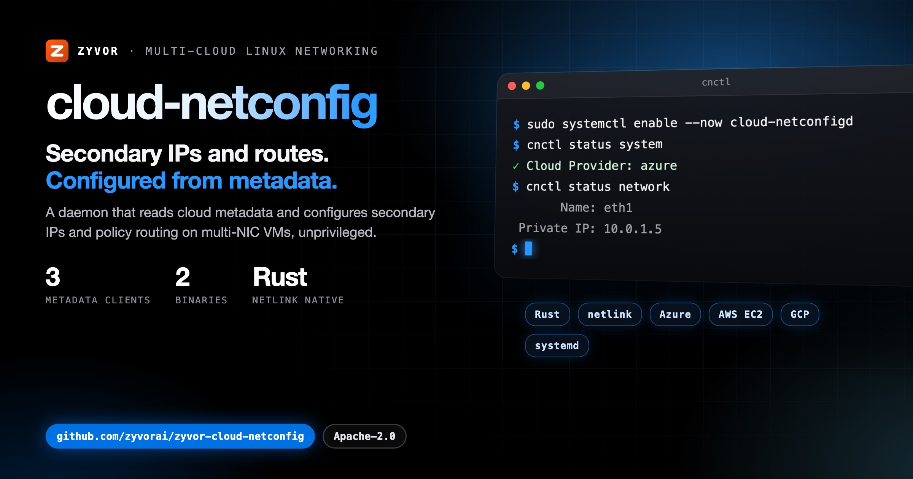

# cloud-netconfig

[](https://github.com/zyvorai/zyvor-cloud-netconfig/actions/workflows/ci.yml)
[](https://www.apache.org/licenses/LICENSE-2.0)
[](https://github.com/zyvorai/zyvor-cloud-netconfig/releases)

[](https://zyvor.dev/schedule?utm_source=github&utm_medium=cloud-netconfig&utm_campaign=readme_hero)
[](https://zyvor.dev/poc?utm_source=github&utm_medium=cloud-netconfig&utm_campaign=readme_hero)



**Automatic network configuration for cloud instances using provider metadata (Azure, AWS, GCP, and others).**

Handles secondary IPs, routing tables, and policy-based routing on multi-interface VMs. Community Edition daemon from the Zyvor Platform suite — runs unprivileged with `CAP_NET_ADMIN`.

📖 **[Enterprise & support](docs/enterprise.md)** · [Demo](https://zyvor.dev/demo?utm_source=github&utm_medium=cloud-netconfig&utm_campaign=readme_hero) · [Contact](https://zyvor.dev/contact?utm_source=github&utm_medium=cloud-netconfig&utm_campaign=readme_hero)

## Contents

- [Features](#features)
- [Installation](#installation)
- [Configuration](#configuration)
- [CLI](#cli)
- [Development](#development)
- [Troubleshooting](#troubleshooting)
- [Enterprise](#enterprise)
- [Support the project](#support-the-project)
- [License](#license)

## Features

- Multi-cloud metadata clients (Azure, AWS EC2, GCP, and more)
- Event-driven reconfiguration via netlink
- Policy-based routing for multi-homed hosts
- Local HTTP API for instance metadata
- Runs unprivileged with `CAP_NET_ADMIN`

## Installation

```bash
git clone https://github.com/hypersdk/cloud-netconfig.git
cd cloud-netconfig
make build
sudo make install
sudo useradd -M -s /usr/bin/nologin cloud-network 2>/dev/null || true
sudo systemctl enable --now cloud-netconfigd
```

## Configuration

Default path: `/etc/cloud-network/cloud-network.yaml`

```yaml
logging:
  level: info
  format: text

server:
  listen:
    address: 127.0.0.1
    port: 5209

metadata:
  refresh_interval: 300s
  request_timeout: 10s

network:
  interfaces:
    enabled:
      - eth1
      - eth2
  routing:
    table_base: 9999
    policy_routing: true
```

Annotated reference: [distribution/etc/cloud-network/config.yaml](distribution/etc/cloud-network/config.yaml).

## CLI

```bash
cnctl status system
cnctl show interfaces
```

## Development

```bash
cargo build --release
cargo test
```

## Troubleshooting

```bash
sudo journalctl -u cloud-netconfigd -f
cnctl status system
```

Enable debug logging in the config file (`logging.level: debug`) when diagnosing metadata or routing issues.

## Enterprise

| | Community Edition (this repo) | Enterprise ([zyvor.dev](https://zyvor.dev/?utm_source=github&utm_medium=cloud-netconfig&utm_campaign=readme_edition)) |
|---|------------------------------|--------------------------------------------------------------------------------------------|
| **Support** | [GitHub Issues](https://github.com/zyvorai/zyvor-cloud-netconfig/issues) | SLA, [sales@zyvor.dev](mailto:sales@zyvor.dev), professional services |
| **Scope** | Open-source daemon | Supported multi-cloud production rollouts |
| **Features** | Multi-cloud metadata clients, event-driven reconfiguration, policy-based routing | Same codebase + fleet automation and rollout support |
| **Platform** | cloud-netconfig | Zyvor Platform migration and operations suite |

| | |
|---|---|
| **Demo** | [zyvor.dev/demo](https://zyvor.dev/demo?utm_source=github&utm_medium=cloud-netconfig&utm_campaign=readme_edition) |
| **ROI** | [zyvor.dev/roi](https://zyvor.dev/roi?utm_source=github&utm_medium=cloud-netconfig&utm_campaign=readme_edition) |
| **Pricing** | [zyvor.dev/pricing](https://zyvor.dev/pricing?utm_source=github&utm_medium=cloud-netconfig&utm_campaign=readme_edition) |
| **Contact** | [zyvor.dev/contact](https://zyvor.dev/contact?utm_source=github&utm_medium=cloud-netconfig&utm_campaign=readme_edition) · [sales@zyvor.dev](mailto:sales@zyvor.dev) |

Community Edition is the open-source daemon. Supported multi-cloud rollouts, SLAs, and Zyvor Platform migration integration → contact Zyvor (not GitHub Issues). Details: [docs/enterprise.md](docs/enterprise.md).

## Support the project

cloud-netconfig Community Edition is free and open source, maintained by **Susant Sahani** · [Zyvor AI Labs](https://zyvor.dev/?utm_source=github&utm_medium=cloud-netconfig&utm_campaign=readme_footer)

- **Enterprise / production:** [zyvor.dev/contact](https://zyvor.dev/contact?utm_source=github&utm_medium=cloud-netconfig&utm_campaign=readme_footer) · [sales@zyvor.dev](mailto:sales@zyvor.dev)
- **Demo and PoC:** [Book a demo](https://zyvor.dev/schedule?utm_source=github&utm_medium=cloud-netconfig&utm_campaign=readme_footer) · [30-day PoC](https://zyvor.dev/poc?utm_source=github&utm_medium=cloud-netconfig&utm_campaign=readme_footer)
- **Community help:** [GitHub Issues](https://github.com/zyvorai/zyvor-cloud-netconfig/issues)

## License

Commercial subscriptions and support: see [docs/SUBSCRIPTION-MODEL.md](docs/SUBSCRIPTION-MODEL.md).

### Open source (Apache-2.0)

This repository is licensed under the [Apache License, Version 2.0](LICENSE.txt).
You may use, modify, and run it for personal, lab, and commercial production
use at no charge, subject to Apache-2.0 (preserve notices / NOTICE where required).

### Enterprise

Production support, SLAs, and Zyvor Enterprise products are licensed separately.
Contact [sales@zyvor.dev](mailto:sales@zyvor.dev) or see [zyvor.dev](https://zyvor.dev/?utm_source=github&utm_medium=cloud-netconfig&utm_campaign=readme_edition).
